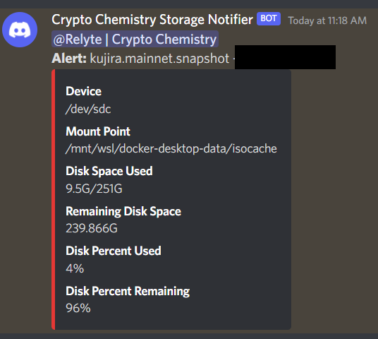

# Storage Notifier

Storage Notifier is a simple Discord webhook script that reports disk usage for specified disks on a local system.

# Usage

**One Time Usage:**

```bash
./storage_notifier.sh -n "kujira.mainnet.snapshot" -b "Crypto Chemistry Storage Notifier" -w "webhook_url" -p 50 -d "/dev/sdc" -u 12345678901234567890
```

## Configuring a Service

Edit the `storage_notifier.service` and `storage_notifier.timer` units as needed.

Symlink to systemd services

```bash
ln -s storage_notifier.timer /etc/systemd/system/storage_notifier.timer
ln -s storage_notifier.timer /etc/systemd/system/storage_notifier.timer
```

Enable services

```bash
systemctl enable storage_notifier.timer 
systemctl enable storage_notifier.service 
```

Start timer

```bash
systemctl start storage_notifier.timer 
```

# Example Notification
